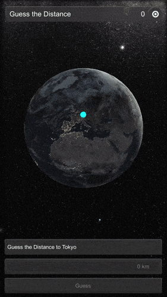

# Guess the Distance

> A location-based "Guess the Distance" game for mobile platforms.

"Guess the Distance" is a small game for mobile platforms that support location services. The project is developed with Unity. It was originally created for use in lectures at the university to teach the principles of location-based services and spherical coordinate systems.

In the game you have to guess the distance from your current location to a city on the globe. Enter your answer in the input field and click "Guess". You score if your answer is not more than 10% off. How many cities in the world do you know? And more importantly, do you know where they are, and can you guess the distance correctly?

     
     
        
     
     

The credit for ["The Milky Way panorama"](https://www.eso.org/public/images/eso0932a/) goes to the European Southern Observatory / Serge Brunier (ESO/S. Brunier).

The credit for the ["Blue Marble"](https://visibleearth.nasa.gov/collection/1484/blue-marble) images goes to Visible Earth and the National Aeronautics and Space Administration (NASA).

## Third Party Content

Many assets of this project including the images of the Milky Way and the Earth were created by other people. Check out the [Third Party Content](/ThirdPartyContent.md) file for details.

## License

This project is licensed under a MIT license. See the [LICENSE](/LICENSE) file for details.

Some (third party) assets in this project may be shared under a different license. Check out the README files in the directories and the [Third Party Content](/ThirdPartyContent.md) file for details.

Also note the dependencies of the project. You can find details about projects loaded as dependency via the Package Manager in the manifest.json in the "Packages" directory.

## Support & Contribute

This project was created by [Daniel Dyrda](https://dyrda.io). If you want to support me and my projects, you can follow me on [github (dyrdadev)](https://github.com/dyrdadev) and [twitter (@daniel_dyrda)](https://twitter.com/daniel_dyrda). Just come by and say hello, I would love to hear how you use the project.

If you want to contribute to this project, you are welcome to do so. Just write me ([Daniel Dyrda](https://dyrda.io)) and we will find a way to collaborate.

     
     
    
     
     

